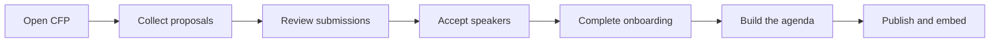

# ConfPilot

**From CFP to published program.**

[](LICENSE)
[](https://github.com/bishnubista/confpilot-open-source/actions/workflows/ci.yml)

ConfPilot is an open-source conference program operations platform for small event teams. It connects work that is usually split across forms, spreadsheets, email, scheduling tools, and website updates — and you run it on your own infrastructure.



> **Status: pre-release.** The connected CFP, review, decision, acceptance, speaker-content, agenda, publication, public-program, and embed workflows are implemented and covered by local automated tests. Cloudflare and single-instance Node/Docker artifacts are available, but clean installation, independent backup/restore, a current-build browser lifecycle, email delivery, and a durable browser conformance suite remain release gates. No independent security assessment has been performed — see [SECURITY.md](SECURITY.md).

## Why ConfPilot

Accepting a proposal should not create another round of manual data entry.

Proposal data moves through the entire lifecycle from one source of truth. Accepting a submission creates or updates the corresponding speaker, session, onboarding tasks, acceptance record, and audit trail without duplicating records.

The organizer experience centers on a **derived readiness trail**:

`Accepted → Profile ready → Deliverables ready → Scheduled → Approved → Published`

Each stage is computed from rows the lifecycle already writes, not stored as a separate workflow state, so it cannot drift from reality. The next operational blocker is always visible.

## Quick start

Requirements: Node.js 22.12.0+ and pnpm 11.16.0.

```bash
git clone https://github.com/bishnubista/confpilot-open-source.git
cd confpilot-open-source
pnpm install
test -e apps/api/.dev.vars || cp apps/api/.dev.vars.example apps/api/.dev.vars
pnpm --filter @confpilot/api db:migrate:local
pnpm --filter @confpilot/api db:seed:local
```

The seed loads a fully populated demo program but contains **no credentials**, so give yourself an account that can sign in:

```bash
install -d -m 700 apps/api/.wrangler
if ! (
  umask 077
  set -e
  set -C
  cat > apps/api/.wrangler/member.json <<'JSON'
{
  "eventSlug": "devflow-conf-2027",
  "role": "organizer",
  "member": {
    "displayName": "Dev Organizer",
    "email": "dev-organizer@community.example",
    "password": "replace-with-a-unique-strong-password"
  }
}
JSON
  chmod 600 apps/api/.wrangler/member.json
); then
  printf '%s\n' 'Refusing to overwrite apps/api/.wrangler/member.json' >&2
  exit 1
fi
pnpm --dir apps/api db:prepare-member -- --input .wrangler/member.json --output .wrangler/member.sql
pnpm --filter @confpilot/api exec wrangler d1 execute confpilot-db --local --file=.wrangler/member.sql

pnpm dev
```

The app runs at `http://localhost:8787`. This provisioning helper accepts `organizer` or `reviewer`. Speakers create their accounts through the public CFP so ConfPilot can create the linked speaker profile the workspace requires. Full detail — including why `db:prepare-bootstrap` is a different operation — is in [CONTRIBUTING.md](CONTRIBUTING.md).

Verify a change with the same gate CI runs:

```bash
confpilot_source_url="https://git.example.org/your-account/confpilot"
pnpm run check && pnpm test && VITE_SOURCE_URL="$confpilot_source_url" pnpm build
```

Replace the example with the canonical public HTTP(S) source URL for the checkout you are building. Modified network deployments must point to their published Corresponding Source, not the upstream repository.

## Capabilities

| Area | What it does |
| --- | --- |
| **Call for papers** | Configurable public CFP, speaker accounts, resumable drafts, deadline enforcement, exact speaker-to-organizer roundtrip |
| **Review and decisions** | Provisioned reviewers, versioned evaluation plans, assignment-pinned immutable scorecards, self-review prevention, comparable aggregate scoring, idempotent acceptance |
| **Speaker readiness** | Organizer-created and CSV-imported roster profiles, logistics, onboarding tasks, headshot and deliverable uploads, file version history, content approval, organizer-only ZIP export of current approved deliverables, inspectable outbox |
| **Agenda** | Multi-day multi-room scheduling, persistent placement, room-overlap rejection, speaker-overlap diagnostics and publication gating, deterministic conflict-avoiding auto-fill |
| **Program and embeds** | Expandable session cards, detailed speaker/itinerary views, search and filters, saved embed configurations, iframe/JSON/filtered iCalendar output, persisted theme/accent/density/visibility controls, unsaved live preview |

**Not in scope** for the first release: payments or ticketing, a full speaker CRM, marketing automation, multilingual support, advanced schedule optimization.

Manual and CSV roster intake creates unclaimed event profiles only. It does not send an invitation or email, and an organizer-created profile cannot sign in. ConfPilot does not currently provide the separately verified invitation or account-link flow required to connect that profile to an account.

## Product invariants

These are enforced in more than one place on purpose, and are the rules any change must preserve:

- Every query and mutation is scoped by event **and** role — SQLite triggers re-check event roles independently of route middleware.
- Accepting the same submission twice cannot duplicate downstream records.
- Public content must be approved, scheduled, and part of a published event.
- Embeds reflect source edits after reload; publication snapshots are not used.
- Speakers, reviewers, organizers, and public visitors see only role-appropriate data.
- No lifecycle stage requires copying proposal or speaker data into another module.

## Architecture

React, Vite, and TypeScript on the frontend. The default Cloudflare host and the single-instance Node host both serve the SPA and Hono API from the **same origin**, so authenticated cookies need no CORS or cross-domain design. Cloudflare uses D1 and private R2; Node uses SQLite and a private filesystem directory behind the same runtime ports. Sessions are opaque and hashed with event-role authorization.

```text
apps/api/src/
  app/          composition root and the feature manifest
  runtime/      ports for external capabilities
  features/     cfp, review, decisions, agenda, publication, speakers
```

Start at [`app/feature-manifest.ts`](apps/api/src/app/feature-manifest.ts): it declares every module, what it owns, and where it mounts. Features never import one another. `runtime/` holds the private file store, captcha verifier, and email sender ports — the only places a non-Cloudflare host would need an adapter, which is why the project describes itself as Cloudflare-first rather than provider-neutral.

Notification handling is intentionally separate from recording a decision. Acceptance materializes the downstream program records without queuing a message; an organizer can then preview and save a notification snapshot to the outbox as a separate action. No email transport is wired in this release, so queued does not mean delivered.

## Self-hosting

The supported pre-release targets are **your own Cloudflare account** and a **single-instance Node/Docker host**. Kubernetes replicas, Postgres, S3/MinIO, and cross-origin SPA/API deployments are not supported.

You need Git, a Git checkout, a Cloudflare account with Workers Paid, a hostname you control, and a plan for upgrades, exports, backups, and recovery. The guarded installation helpers use Git to verify that credential-bearing configs and generated artifacts are ignored, so downloaded source archives are not a supported installation path. Cloudflare services are usage-based; review current pricing and set billing alerts before provisioning. **Cloning this repository creates no remote resource and costs nothing.**

Choose one supported deployment path:

- [Cloudflare](docs/self-hosting/cloudflare.md): one Worker serves the SPA and API, with D1 for relational data and a private R2 bucket for files.
- [Node/Docker](docs/self-hosting/node.md): one application instance uses SQLite and a private filesystem directory, with a reverse proxy providing HTTPS.

Both guides cover required configuration, database bootstrap, and verification, and link to the backup and upgrade procedures for that host. Never apply the demo seed files to a production database.

## Documentation

| Guide | For |
| --- | --- |
| [CONTRIBUTING.md](CONTRIBUTING.md) | Local setup that can sign in, code layout, verification gate |
| [AGENTS.md](AGENTS.md) | AI coding agents: navigation, invariants, what never to do autonomously |
| [Self-host on Cloudflare](docs/self-hosting/cloudflare.md) | Operators installing an instance |
| [Self-host with Node/Docker](docs/self-hosting/node.md) | Single-instance SQLite/filesystem operators |
| [Agent-assisted installation](docs/self-hosting/agent-install.md) | Installing via an AI agent, with every human-approval gate marked |
| [Upgrading](docs/upgrading.md) · [Backup and restore](docs/backup-restore.md) | Running an instance over time |
| [Deployment operations](docs/operations/cloudflare-deployment.md) | Migration safety, cost boundaries, rollback, DNS |
| [Licensing](docs/licensing.md) | What the AGPL means for self-hosters and contributors |
| [SECURITY.md](SECURITY.md) · [CODE_OF_CONDUCT.md](CODE_OF_CONDUCT.md) · [CHANGELOG.md](CHANGELOG.md) | Reporting, participation, and release notes |

### Machine-readable surfaces

A running instance publishes anonymous, read-only data for AI agents and integrations:

- `/llms.txt` — generated from published events; describes the instance and lists the endpoints below
- `/api/agent/manifest` — every authenticated operation, the role it needs, whether a repeat is safe, and the headers each mutation must carry
- `/api/program?event=<slug>` · `/api/program/speakers?event=<slug>` — published program as JSON
- `/api/program.ics?event=<slug>` — iCalendar with stable event identities
- `/api/cfp/<slug>` — CFP status, deadlines, and submission fields
- `/api/public/events/<slug>/embeds/<embed>` — saved embed configuration and filtered program as JSON
- `/api/public/events/<slug>/embeds/<embed>/calendar.ics` — the same saved filter as a subscribable iCalendar feed

Unpublished sessions, speaker contact details, uploaded files, and review data are never exposed on these routes.

The public program can also create an attendee-selected calendar with a same-origin
`POST /api/program.ics` request containing `{ "event": "<slug>", "sessionSlugs": [...] }`.
Selections are bounded to 100, carried in the private request body rather than the URL,
and rejected if any selected session is no longer public. The response uses
`Cache-Control: private, no-store`. This POST is intended for the program UI, not the
anonymous read-only discovery index.

### Operating an instance with an agent

`/llms.txt` covers what an anonymous reader can fetch. `/api/agent/manifest` covers what an
authenticated caller can **do** — the part a non-browser client cannot infer. It is itself
anonymous, structural, and reads nothing from the database, because an agent needs it before
it can sign in. It names no event and exposes no counts.

For each operation it publishes the role required, a **retry mode** (`safe`, `replay`,
`guarded`, `idempotency-key`, `unsafe`) so a client knows what a repeat after a network
failure will do, and an **approval mode** — `human` marks the operations that publish,
notify, decide someone's proposal, or write a record ConfPilot treats as immutable. Approval
mode is advice to the integration author; the API enforces roles regardless.

Operations in the `idempotency-key` mode also say where the key belongs, because the
location is not uniform: a multipart upload has no JSON body to carry one and reads an
`Idempotency-Key` header, while JSON writes require an `idempotencyKey` body field.

Every mutation must carry `Origin` and `X-ConfPilot-Request: 1`, and must not send a
`Sec-Fetch-Site` other than `same-origin`. A browser and the SPA do this automatically; a
scripted client must set them or receive `403 UNSAFE_REQUEST_REJECTED`.

The catalog is reconciled against the composed router in both directions by
`apps/api/test/agent-manifest.test.ts`, so a route cannot be added, removed, or renamed
without the manifest following. Adding a route with no annotation fails the suite.

No AI model is called anywhere in ConfPilot, and none is required to use this surface.

## Contributing

See [CONTRIBUTING.md](CONTRIBUTING.md) and [CODE_OF_CONDUCT.md](CODE_OF_CONDUCT.md). Commits are signed off under the [DCO](https://developercertificate.org/) (`git commit -s`).

Feedback is especially welcome on conference program operations, reviewer workflows, speaker onboarding, scheduling, public program experiences, and safe multi-event data isolation.

Keep credentials, provider account identifiers, local machine paths, private URLs, and real attendee data out of the repository. Seed identities are fictional and use reserved example domains.

## License

ConfPilot is licensed under the **GNU Affero General Public License v3.0 or later** — see [LICENSE](LICENSE) and [NOTICE](NOTICE).

Self-hosting is fully permitted. If you **modify** ConfPilot and offer it to others over a network, AGPL section 13 requires you to offer those users your modified source; point `VITE_SOURCE_URL` and `SOURCE_URL` at your published fork. Running an unmodified copy adds no obligation beyond keeping the notices intact. [docs/licensing.md](docs/licensing.md) explains this in practice.

Every dependency is under a license compatible with AGPL redistribution; re-check with `node scripts/audit-licenses.mjs`.
