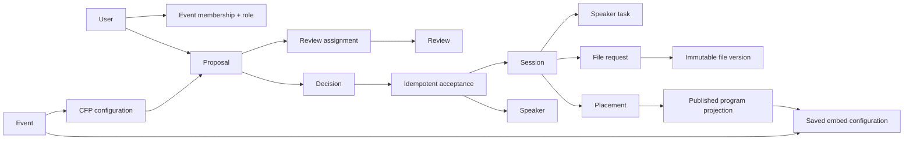

# Backend foundation

Status: executable schema foundation, grounded in the current frontend and Phase 0 API contracts.

## What the frontend requires

The current interface exposes four distinct trust surfaces:

| Surface | Current routes | Data it implies |
| --- | --- | --- |
| Anonymous | `/program`, `/submit` | published event/program data; CFP configuration; speaker-owned drafts and submissions after authentication |
| Organizer | `/admin/*` | event configuration, submissions, aggregate review state, decisions, readiness, content approval, agenda, embeds, audit activity |
| Reviewer | `/reviewer` | event membership, explicit assignment invitations, blind proposal projection, conflict/recusal controls, one submitted scorecard per accepted assignment/round |
| Speaker | `/speaker-portal` | own proposals, accepted sessions, profile, tasks, file requests and immutable file versions |

The primary CFP, reviewer, decision, speaker-content, agenda, embed, and public-program workflows now use event-scoped API integrations. The landing page, overview dashboard, and design-system showcase retain deterministic demo presentation data; they are not persistence or authorization boundaries.

## Domain boundaries

The central modeling rule is that a proposal and a program session are different records.

A proposal remains the submitted dossier and review subject. An accepted decision materializes or links the downstream session and speaker records exactly once. This preserves proposal history while allowing public copy, readiness, files, and scheduling to evolve independently.

## Target schema

### Identity and tenancy

- `users`: account identity; no event-specific role column.
- `event_memberships`: unique `(event_id, user_id)` with `organizer`, `reviewer`, or `speaker` role. Every private query starts from this table.
- `auth_sessions`: opaque cookie tokens are stored only as hashes, with expiry and revocation. Browser role selection is never authorization.

### CFP and review

- `cfp_configs`: event-scoped open/close times, published state, and revision.
- `cfp_fields`: ordered field definitions and conditional-display rules. Stable field keys preserve roundtrip fidelity.
- `proposals`: event, public identifier, status, title, abstract, track, format, duration, and timestamps. Account ownership and configurable answers remain part of the CFP-write slice.
- `proposal_answers`: field-keyed values for configurable fields that are not first-class indexed columns.
- `proposal_presenters`: proposal/speaker link with primary or co-presenter role. The set is immutable after acceptance.
- `review_rounds`: organizer-managed named review stages with an enforced open/close window (checked in route code at assignment creation and review submission, matching the CFP window-enforcement layer), a blind default, and a stable position. Rounds with plans or assignments cannot be deleted. Naming note: this event-level entity is distinct from `review_assignments.round`, which remains the per-proposal/reviewer retry counter.
- `review_round_reviewers`: per-round reviewer pool entries. SQL requires the reviewer to hold same-event reviewer membership and the adder to be a same-event organizer; entries with active round assignments cannot be removed. Assignments attached to a round must reference a pool member.
- `review_assignments`: event, proposal, reviewer user, server-derived round, optional review-round reference, blind flag, soft-revocation state, due time, and immutable response-required marker; unique per proposal/reviewer/round. New assignments require reviewer acceptance before scoring. Each revoked row is terminal, while reassigning the same reviewer creates the next round so an organizer can correct assignment settings without rewriting history. Reviewer membership is rechecked when the assignment is created, read, responded to, and submitted, while the durable assignment survives later membership removal. Invitation responses, recusals, and conflict declarations deliberately remain allowed after a round closes: they are audit bookkeeping on existing assignments.
- `review_assignment_actions`: append-only accept, decline, and recusal actions owned by the assignment's exact event reviewer. A first response is immutable; an accepted assignment permits one later recusal only before review submission.
- `reviewer_conflicts`: immutable reviewer declarations tied to an exact assigned event/proposal/reviewer tuple. A declaration closes the current assignment and blocks that reviewer from being assigned to the same proposal again.
- `reviews`: one immutable submitted evaluation per assignment with fixed originality/relevance scores, recommendation, comment, and submitted time. Completion is derived from the review row rather than duplicated on the assignment.
- Evaluation plans are per scope: one event-default plan plus at most one plan per review round (partial unique indexes distinguish the two). Plan versions may carry immutable builtin-field display labels for the canonical recommendation options and the comments field; storage stays `accept`/`discuss`/`reject` and CSV exports keep canonical headers, so labels are a display seam, not a storage change.
- Named-round auto-assignment considers both undecided and decided proposals in the selected track. This supports explicit follow-up rounds without changing an existing decision; organizers should scope the track and reviewer cap deliberately.
- `decisions`: one immutable event-scoped decision per proposal, who recorded it, rationale, and time. SQL requires the actor to hold organizer membership. Notification state does not live here.

### Acceptance and speaker operations

- `acceptances`: unique event-scoped proposal, decision, program session, and idempotency key. The atomic materializer requires exactly one primary proposal presenter, copies the accepted proposal into one program session, preserves all proposal presenters, and creates four default tasks per presenter. Notification preview and queueing remain separate explicit actions. Replays for the same proposal reuse the same records; reusing a key for another acceptance is a typed conflict.
- `speakers`: event-specific public profile linked to a user where one exists.
- `program_sessions`: accepted program copy and publication/readiness state, distinct from the immutable proposal dossier.
- `session_presenters`: session/speaker link with primary or co-presenter role; uniqueness prevents duplicate people on a session.
- `speaker_tasks`: the four initial per-speaker/session requirements materialized on acceptance. Event-configurable task definitions remain a later slice.
- `deliverable_requests` and `deliverable_versions`: requested presentation deliverables plus append-only private-object metadata. Replacing a file creates a version; it does not overwrite history. The organizer content library lists every version and downloads each one through the event-scoped, organizer-authorized private-file route; responses never expose R2 object keys or bucket URLs.
- `GET /api/events/:eventSlug/content/deliverables.zip`: an organizer-only, event-scoped ZIP32 export. The content library's version-history access does not broaden this export: it includes only each active request's current version when that version's latest review is approved. Object metadata is verified before response streaming and again at read time; files are streamed sequentially from private storage without public bucket URLs or whole-archive buffering. Before any storage reads, the request fails closed above 20 entries or 25 MiB of file content so its D1/R2 subrequests and JavaScript checksum work remain bounded by the configured Worker budget; ZIP32 limits are enforced as a second line of defense.
- `content_reviews`: version-specific approval decisions with actor, idempotency key, and time, rather than only a mutable status flag.

### Scheduling, distribution, and evidence

- `event_days`, `rooms`, and `schedule_placements`: persisted agenda records. Placement instants use canonical UTC-second strings so SQL ordering and room-overlap checks are chronological. SQL protects same-event references and rejects room overlap. The agenda service derives presenter-overlap diagnostics for manual placements and blocks publication until they are resolved; deterministic auto-placement avoids both room and presenter conflicts.
- `public_embed_configs`: event, slug, view type, canonical filter JSON, primary output format, constrained presentation settings, enabled state, revision, and timestamps. Organizer previews apply unsaved presentation changes in the browser; anonymous iframe, JSON, and filtered iCalendar reads expose only the fields their renderer needs, use the persisted configuration, and always resolve the same live published projection. Migration defaults keep legacy embeds' pre-customization visibility (`show_* = 0`), while newly created embeds use the contract's visible-control defaults. Embed `PATCH` is a revision-guarded full replacement of mutable configuration: clients must echo `outputFormat` and `appearance`, and omission fails validation instead of resetting saved values.
- `notification_outbox`: queued delivery intent separate from the decision. A unique semantic key prevents duplicate sends.
- `audit_events` *(planned)*: append-only actor, event, action, target, timestamp, request ID, and bounded metadata.

## Invariants and enforcement

| Invariant | Primary enforcement |
| --- | --- |
| Foreign records belong to the same event | composite uniqueness/foreign keys where D1 permits; migration triggers otherwise |
| Private access has the required event role | Hono authorization middleware backed by `event_memberships` |
| Anonymous program data comes only from a published event | query predicate, covered by integration tests |
| Public sessions are accepted, approved, scheduled, and published | query predicate, covered by integration tests |
| Acceptance cannot duplicate downstream records | one atomic D1 batch, event-scoped deterministic child IDs, explicit conflict targets, and unique proposal/decision/session/idempotency constraints; rollback is exercised against Miniflare/D1 |
| A reviewer sees only assigned proposals | assignment-scoped query using the authenticated event and reviewer user; out-of-scope, revoked, and missing IDs share the same not-found response |
| Blind review omits structured author data | dedicated reviewer projection; only session-section answers are selected, and owner/email/presenter fields are never spread into blind responses |
| A reviewer cannot score their own proposal | owner and presenter identity are checked when assigning and rechecked at scorecard submission in both the route and SQL trigger |
| A reviewer controls assignment participation | every new assignment starts with a pending invitation; only its event reviewer can accept, decline with a reason, recuse after acceptance, or declare a categorized conflict |
| A declined, recused, or conflicted assignment cannot be scored | route checks and the review-insert trigger independently require an accepted action with no terminal action or conflict declaration |
| A submitted review cannot be edited | one review per assignment, immutable SQL triggers, identical-payload retry returns the existing row, changed payload returns a conflict |
| A speaker changes only their own records | authenticated user-to-proposal/speaker ownership query |
| Notification is not implied by a decision | separate outbox row and explicit queued state |
| File history is preserved | append-only deliverable versions; object keys are never client-authoritative |
| Schedule has no room overlap | canonical UTC placement instants plus SQL overlap triggers |
| Published schedule has no presenter overlap | agenda diagnostics allow organizers to see manual conflicts, publication rejects unresolved conflicts, and auto-placement avoids creating them |

## Migration ownership

`migrations/` is the sole authoritative D1 schema and deployment history. Migrations are ordered, hand-authored SQL because event-integrity, immutability, and overlap rules depend on explicit foreign keys, `CHECK` constraints, indexes, and triggers. Application queries use parameterized D1 prepared statements with explicit row interfaces and API view models; there is no second ORM schema to keep in sync.

Never edit a migration that has been released. Add a forward-only migration, update the affected query contracts, and extend the integration tests that pin load-bearing indexes, constraints, triggers, and event-scoped behavior. Wrangler applies only the ordered files in `migrations/`.

For production, apply and verify each D1 migration before deploying Worker code that depends on it. The `0000`-through-`0025` catalog is forward-only, but that does not make every older Worker compatible with every newer schema. In particular, `0008_workers_password_iterations.sql` preserves existing 600,000-iteration credential rows while its triggers require newly inserted or materially updated credentials to use 100,000 iterations; rolling back to a pre-`0008` credential writer can therefore fail. Before any Worker rollback, compare that version's schema expectations and credential writes with the exact deployed migration ledger. Prefer a forward fix when compatibility is unproven; a schema restore requires an explicitly approved recovery operation, and released migrations are never reversed or rewritten.

## Executable API

The current API is composed from the lifecycle modules in `apps/api/src/app/feature-manifest.ts`. Its connected surfaces include:

- anonymous event, CFP, program, speaker, calendar, and saved-embed reads;
- credential sign-in, hardened server sessions, sign-out, and Turnstile-protected speaker registration;
- speaker-owned proposal drafts and immutable submission;
- organizer reviewer assignment/revocation, review progress, decisions, acceptance, and notification-outbox snapshots;
- reviewer-owned queues, dossiers, and immutable scorecards;
- owner-scoped speaker profiles, onboarding tasks, headshots, presentation versions, comments, and accepted-session continuity;
- organizer speaker/content management, content review, revisioned history, readiness, agenda placement, conflict diagnostics, auto-fill, publication, and embed configuration.

All private routes resolve the authenticated user through an event membership and apply their role/ownership boundary again in the query or D1 trigger. The acceptance materializer is exposed only through the organizer decision workflow and remains idempotent. The seed contains fictional lifecycle data but no reusable credential; local operators provision organizer/reviewer accounts through ignored offline artifacts, while speaker accounts are created through the public CFP.

Reviewer assignments currently evaluate the live submitted dossier. Organizers should begin assignment after the CFP closes; a durable proposal/config revision snapshot is intentionally deferred until rolling review is required. That limitation must remain visible in the organizer UI rather than being implied away.

Blind answer filtering uses each CFP field's current `section`. Changing a past field from `speaker` to `session` changes what future reviewer reads expose, so field-section changes require the same organizer care as changing the review form itself.

## Frontend status

The scoped CFP, abstract/review, speaker, content, agenda, embed, reviewer, speaker-portal, and public-program routes use connected API data with loading, error, authorization, and reload states. The unscoped landing page, `/admin` overview, and design-system showcase intentionally retain clearly labelled illustrative presentation data; they are not persistence or authorization evidence.

The next frontend architecture task is to connect the organizer overview to the existing derived-readiness endpoint without turning the overview into a second source of lifecycle truth. Browser-local state must never be treated as an authorization or persistence boundary.
