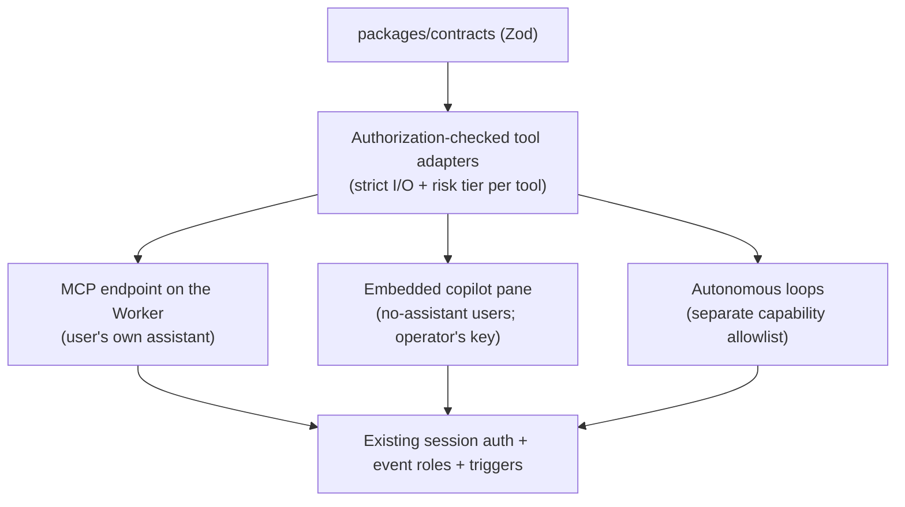

# Plain-language interface: operating ConfPilot conversationally

Status: design proposal — companion to `ai-native-loops.md`. That document designs the loops that let the program run itself; this one designs the interface that lets anyone drive the product in plain language. Together they are the AI-native architecture: autonomy behind the scenes, natural language in front, and one shared tool layer serving both.

## The goal, stated as a test

**The form-free demo:** a person with no ConfPilot training creates an event, opens a CFP, reviews what came in, accepts talks, chases speakers, builds the agenda, and publishes it — entirely by saying what they want, confirming the consequential steps, and never learning the admin UI. When that demo works, the product is AI-native in the interface sense. The admin UI does not go away; it becomes the inspection surface (and the fallback), while conversation becomes the operating surface.

Example utterances the system must handle, by persona:

| Persona | Utterance | What happens |
| --- | --- | --- |
| Organizer | "What's blocking my program?" | Readiness-trail query, grouped by stage, with the blocking reason per speaker |
| Organizer | "Open a CFP for a 2-day, 3-track conference in March; close submissions Jan 15" | Draft event + days + tracks + CFP config, shown for confirmation, then created |
| Organizer | "Accept the top 12 talks by review score and notify the speakers" | Server computes the eligible set and deterministic top 12 (proposal IDs, score snapshot, and tie-break), then shows a decision/recipient preview → exact confirmation → acceptance materialization → notification queue |
| Organizer | "Move the Rust talk to Thursday 2pm" | Placement change through the conflict-checked agenda service; refusal comes back in plain language ("Room 2 is occupied by X — Room 3 is free then") |
| Speaker | "When do I talk, and what do I still owe you?" | Own session + own open tasks/deliverables, nothing else |
| Reviewer | "Which of my assignments are due this week?" | Own assignment queue |
| Attendee (public) | "What should I see Thursday if I care about observability?" | Published-program query over the same anonymous data the embeds use |

## Why this is packaging, not a rewrite

Three existing decisions do most of the work:

1. **Every operation already has a strict contract.** `packages/contracts/src/` defines `z.strictObject` schemas for each request (`cfpConfigUpdateSchema`, decision, agenda, speaker-content, …). A tool definition is a name, a description, and a JSON schema — the schemas exist; conversion is mechanical.
2. **Every actor already has a scoped role.** Event-role authorization (organizer/reviewer/speaker) plus the SQLite trigger layer means a language model cannot be talked into an action its session could not perform by hand. The security boundary is the existing one; the interface adds no new authority.
3. **The hardest query is already answered.** "What's blocking my program?" is the readiness trail — derived state, so the conversational answer is trustworthy by construction rather than by prompt quality.

The design therefore centers on one new artifact — a **tool layer** over the existing service functions — consumed three ways:

One adapter layer, separate capability matrices. Public tools, speaker/reviewer tools, organizer MCP/copilot tools, and autonomous loops each have an explicit allowlist; sharing an implementation never grants one consumer everything another can do. Direct invocation tests enforce each matrix, not just tool-list filtering.

## Design decisions

### 1. Tools are generated from contracts, with two hand-written additions

Each tool = authorization-checked service adapter + strict input/output contract and redaction + a natural-language description + a **risk tier**. The actor and event come from the authenticated session or a scoped service principal, never model arguments. The server owns recipient resolution, idempotency keys, and authoritative previews. Contract-derived generation reduces drift, but two things are authored by hand because they cannot be derived:

- **Descriptions written for a model choosing among tools** ("Use for changing when/where a session runs; placement is rejected if the room is occupied"), not doc-comments for humans.
- **Risk tiers**, the load-bearing safety metadata:
  - `read` — execute freely, no confirmation.
  - `write:reversible` — only for a concrete, atomic compensating operation bound to a version; if reliable undo cannot be implemented, classify the tool as consequential.
  - `write:consequential` — **always** preview + explicit confirmation: decisions, acceptance, anything entering `message_outbox`, publishing, deletions. This generalizes the `[AUTO]`/`[GATE]` pattern the agent-install runbook already established for operators into the product itself.

A conversational turn may chain many `read` calls but at most one pending `write:consequential` confirmation — no "confirm 9 things at once" walls, which train people to click yes. Confirmation is an expiring, single-use server token bound to the normalized tool name/arguments, actor, event, resolved recipients, authoritative preview, and current subject versions. Execution revalidates state, consumes the token, applies a server-owned idempotency key, and writes the mutation plus audit record atomically.

### 2. MCP endpoint first, embedded copilot second

**Phase A/B ship an MCP server on the existing Worker** (same origin, e.g. `/mcp`), authenticated by the same opaque session tokens. Listing and direct invocation both enforce the consumer/role allowlist, event scope, strict schemas, and response redaction. Rationale: it is the cheapest path to the full demo (AI-native early adopters already have an assistant; ConfPilot pays zero inference cost), and it forces the tool layer to be right before any chat UI exists. Cloudflare's remote-MCP support keeps this within the repo's Cloudflare-first rule. The public subset (published program, CFP info) is exposed unauthenticated and can only reach approved, scheduled content belonging to a published event.

**The embedded copilot (Phase C) uses the same adapters through its own allowlist** in the admin UI, for the majority who do not bring their own assistant — this is where "anyone can use it" is actually won. Its server-side tool loop uses the durable runner, per-event budgets, and data-handling controls from `ai-native-loops.md` Phase 0. Confirmation is rendered as a structured **action card** from the server's authoritative preview ("Accept these 12 proposal IDs → 12 speakers created, these resolved recipients queued") and carries the exact single-use confirmation token — never "the model says it's fine" prose. Every executed action lands atomically in `audit_events`, with the principal distinguishing user-confirmed conversational actions from autonomous loop actions.

### 3. Conversational onboarding is a first-class flow, not a chat trick

The single highest-leverage moment for "anyone can use this" is the empty state. "I'm running a two-day AI conference in Kathmandu in March, three tracks, CFP closes January 15" should yield a complete draft — event, days, tracks, CFP fields, deadlines — rendered as one reviewable card, editable by either conversation or form. Creation still uses the exact confirmation protocol: the server normalizes the draft, validates current state, shows the authoritative effect, and binds confirm to that version. This reuses the same adapters (`create_event`, `update_cfp_config`, …); what is special-cased is only the UI treatment. The measure of success: median time from first login to open CFP drops from "an afternoon of forms" to minutes.

### 4. Language boundaries stay honest

- The model **plans and narrates; the service layer decides.** Conflict detection, deterministic top-N selection and tie-breaking, scoring arithmetic, readiness computation, recipient resolution, actor/event identity, and scheduling constraints remain in code. When the service layer refuses or state changed after preview, the copilot explains and re-previews — it never overrides it.
- **Untrusted text stays data.** Proposal content and speaker replies flowing through conversational context are subject to the same rule as in the loops doc: they can inform answers, but tool calls acting on them at `write:consequential` tier always pass through the human confirmation card. The injection-corpus CI fixture from loops Phase 1 extends to interface tools.
- **Rendering/delivery stay AI-free** (`messaging.md`): conversation can *queue* a notification (gated), but composition-to-template and delivery remain deterministic.

## Phasing

**Phase A — read-only tools + MCP endpoint (1–2 weeks, can precede or parallel loops Phase 0).** Generate read tools from contracts (readiness, proposals, reviews summary, roster, agenda, program), MCP endpoint with session auth + role-scoped listing, public unauthenticated subset. No inference cost to the operator; immediately demoable ("connect Claude to your instance and ask what's blocking").
- [ ] Tool defs generated from `packages/contracts`; drift test fails CI if a contract changes without its tool
- [ ] Role-scoping tests cover both listing and direct invocation: a speaker session cannot call or receive another speaker's data; public calls cannot reach unpublished data; cross-event identifiers fail closed
- [ ] Output-schema and redaction tests prevent hidden/private fields from leaking through tool results or errors
- [ ] "What's blocking my program?" answered correctly against a seeded event

**Phase B — gated writes over MCP (2 weeks).** Risk-tier metadata and the exact expiring, single-use confirmation protocol; consequential writes always use server-normalized previews and state revalidation.
- [ ] The form-free demo passes end-to-end via an external assistant, with every consequential step individually confirmed
- [ ] Injection corpus extended to write tools; altered arguments, actor/event/recipient, expired/replayed token, stale state, and duplicate execution all fail without a second side effect
- [ ] Every successful consequential write and its confirmation/audit record commit atomically; every reversible tool proves its compensating operation

**Phase C — embedded copilot pane (2–3 weeks, requires loops Phase 0 foundations).** Chat pane in admin + speaker portal, durable server-side tool loop through `agent-runner`, streaming, authoritative action cards, per-event budget and spend meter, input allowlists, retention/deletion controls, timeouts, leases, bounded retry/concurrency, and a manual-failure queue. Copilot is disabled (pane absent) when no API key is configured — same opt-in posture as the loops.
- [ ] A non-technical tester completes CFP-to-published-agenda without opening a non-chat admin screen
- [ ] A 10–30-turn organizer pilot reports actual provider/model usage and billed-versus-estimated cost, visible per event alongside loop spend and bounded by the operator-set budget

**Phase D — conversational onboarding + public attendee Q&A (2 weeks).** Empty-state draft flow; public program Q&A widget on `/program` using only the public capability subset. Before inference it enforces hard per-event spend, request, token, and concurrency budgets, bounded input/output, cache reuse for equivalent published-program questions, and a circuit breaker; operator opt-in remains required because anonymous traffic spends their tokens.
- [ ] First-login-to-open-CFP median under 10 minutes for a first-time user
- [ ] Attendee questions answered strictly from published data — nothing unpublished is reachable from the public surface (property test)
- [ ] Exhausted budgets, provider failure, cache hits, and circuit-breaker state are visible and fail closed without inference or private-data fallback

## Non-goals

No voice interface, no fine-tuned models, no client-side API keys in the browser, no conversational surface for review scoring or decision *judgment* (the copilot presents; humans decide — same permanent boundary as the loops). And no removal of the forms: accessibility, auditability, and user preference all require the deterministic UI to remain complete.
